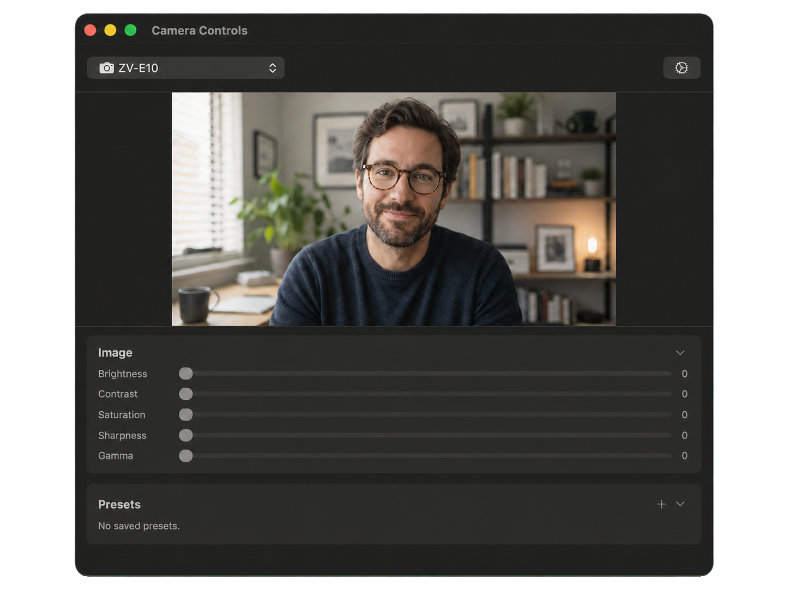

# MacWebcamController

A lightweight macOS menu bar app to control UVC camera settings — brightness, contrast, saturation, white balance, focus, and more — directly from your menu bar or a full standalone window.

<p align="center">
  
</p>

> **Inspired by [CameraController](https://github.com/itaybre/CameraController)**,
> which is no longer actively maintained. MacWebcamController is a
> modern, open-source rewrite built with SwiftUI and native IOKit.

> [!NOTE]
> MacWebcamController is still a work in progress. Some features may not work as expected, and bugs are possible. Bug reports and feedback are welcome.
---

## Features

- 📷 **Supports UVC-compliant USB cameras** and automatically shows the controls each device reports
- 🖥️ **Menu bar mode** and 🪟 **Standalone window mode**
- 🎥 **Live camera preview** in the full window and, optionally, directly in the menu bar popover
- 🤖 **Auto exposure, auto white balance & auto focus toggles**
- 💾 **Camera presets**
- 🔄 **Per-camera settings persistence**, including automatic restore after reconnecting or changing USB ports
- 🔃 **Reset all controls to device defaults** — one-click button in the menu bar and full window
- 🚀 **Launch at Login**
- 🍎 **Native macOS app** — built with SwiftUI + AppKit, no external dependencies
  
---

## Requirements

- **macOS 26 (Tahoe)** or later on Apple Silicon
- An external USB UVC-compliant camera
  _(built-in FaceTime cameras have limited UVC support due to Apple restrictions)_
- Xcode 26 or later (to build from source)

---

## Installation

Download the latest version from the [GitHub Releases page](https://github.com/CaskLabs/MacWebcamController/releases), move MacWebcamController.app to your Applications folder, and open it.

Homebrew
```bash
brew install --cask CaskLabs/tap/macwebcamcontroller
```

>[!NOTE]
> Current builds are unsigned and not notarized.
> If macOS blocks the app, allow it under System Settings → Privacy & Security → Open Anyway.
>
> Alternatively:
>
> ```bash
> xattr -dr com.apple.quarantine /Applications/MacWebcamController.app
> ```

Build from Source
1. Clone the repository.
2. Open `MacWebcamController.xcodeproj` in Xcode 26 or later.
3. Select your Mac and build and run with ⌘R.
   
No additional configuration is needed — the app has the sandbox disabled to allow direct IOKit USB access.

---

## Usage

- **Menu bar icon (left-click)** — opens the compact popover with a camera picker and quick sliders for brightness, contrast, white balance, exposure and focus. Only controls supported by the connected camera are shown.
- **Menu bar icon (right-click)** — shows a context menu with "Open Full Controls", "Settings", and "Quit"
- **Auto toggles** — Auto Exposure toggle appears above the exposure slider in both the popover and the full window; Auto White Balance and Auto Focus work the same way
- **Reset button** — the ↺ button next to the camera picker in the menu bar resets all controls to device defaults
- **Full controls** — click "Open Full Controls" (or right-click the icon) to open the main window with all UVC controls organised in collapsible sections
- **Menu bar preview** — enable "Show Camera Preview in Menu Bar" in Settings to add a 16:9 live preview to the compact popover
- **Settings** — click the gear icon in the popover footer, the main window, or the menu bar icon's right-click menu to open the settings page (appearance, menu bar preview, launch at login)
- **Presets** — in the Presets section, click + to save the current settings as a named preset; apply, update, or delete presets at any time
- **Reset** — click "Reset" to restore all controls to their device defaults

---

## Architecture

```
MacWebcamController/
├── MacWebcamControllerApp.swift   # App entry point, AppDelegate, status bar right-click menu, dock icon management
├── UVC/
│   ├── UVCConstants.swift         # UVC spec constants (request codes, descriptor types)
│   ├── UVCControl.swift           # Enum of all UVC controls with selectors and data lengths
│   ├── UVCDescriptorParser.swift  # Parses config descriptors → PU/CT IDs and bmControls
│   ├── UVCDevice.swift            # IOUSBHostDevice wrapper: getValue / setValue
│   └── UVCDeviceDiscovery.swift   # IOKit matching for Video Control interfaces
├── Camera/
│   ├── CameraManager.swift        # AVFoundation discovery + hot-plug detection
│   └── CameraInfo.swift           # Per-camera data model (name, IDs, UVCDevice)
├── ViewModel/
│   ├── CameraViewModel.swift      # @Observable bridge between UVC hardware and SwiftUI
│   └── ControlState.swift         # Per-control state: current, min, max, default, resolution
├── Views/
│   ├── MenuBarView.swift          # Compact popover with quick controls
│   ├── MainWindowView.swift       # Full control window with collapsible sections
│   ├── ControlSliderView.swift    # Reusable slider with immediate visual response
│   ├── CameraPickerView.swift     # Camera selection dropdown
│   ├── CameraPreviewView.swift    # Live AVCaptureSession preview
│   └── SettingsView.swift         # Inline settings (appearance, launch at login)
└── Persistence/
    └── SettingsPersistence.swift  # UserDefaults persistence + preset JSON storage
```

**Tech stack:**
- UI: SwiftUI + AppKit
- Camera discovery: AVFoundation
- UVC control: IOKit / IOUSBHost (direct USB control requests, no external libraries)
- Persistence: UserDefaults (per camera, matched by device ID with a camera-name fallback after USB port changes)
- Concurrency: Swift 6 strict concurrency, dedicated serial DispatchQueue for IOKit I/O
- Tests: XCTest coverage for UVC descriptor parsing, value encoding, settings persistence, and camera matching

---

## Supported UVC Controls

| Control                | Unit             | Signed |
|------------------------|------------------|--------|
| Brightness             | Processing Unit  | yes    |
| Contrast               | Processing Unit  | no     |
| Saturation             | Processing Unit  | no     |
| Sharpness              | Processing Unit  | no     |
| Gamma                  | Processing Unit  | no     |
| White Balance (temp)   | Processing Unit  | no     |
| Gain                   | Processing Unit  | no     |
| Backlight Compensation | Processing Unit  | no     |
| Powerline Frequency    | Processing Unit  | no     |
| Exposure (absolute)    | Camera Terminal  | no     |
| Focus (absolute)       | Camera Terminal  | no     |

Not all cameras support all controls — unsupported controls are automatically hidden in both the menu bar popover and the full window.
Auto exposure, auto white balance and auto focus toggles are shown only when the camera reports support for them.

---

## References

- [USB Video Class 1.5 Specification](https://www.usb.org/document-library/video-class-v15-document-set)
- [CameraController](https://github.com/itaybre/CameraController) — original inspiration, Objective-C + IOKit
- [uvc-util](https://github.com/jtfrey/uvc-util) — CLI reference for UVC descriptor parsing

---

## Planned / TODO

- [ ] **First Release**
- [ ] **Resizable Camera Preview in window mode**
- [ ] **Optimization of the window mode for bigger screens**
- [ ] **iCloud Sync Settings** (optional)

---

## Contributing

Contributions are welcome. Open an issue to discuss ideas or bugs, or submit a pull request directly.
